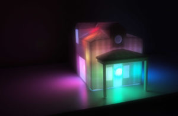

# LivelyLight

## PIR motion sensor + LED Strip 

Create a simple interacte art piece using LEDs, motion sensors, and Arduino boards.

### Example: Display rainbow colors on motion

Source: [rainbowMotion.ino](rainbowMotion.ino)
